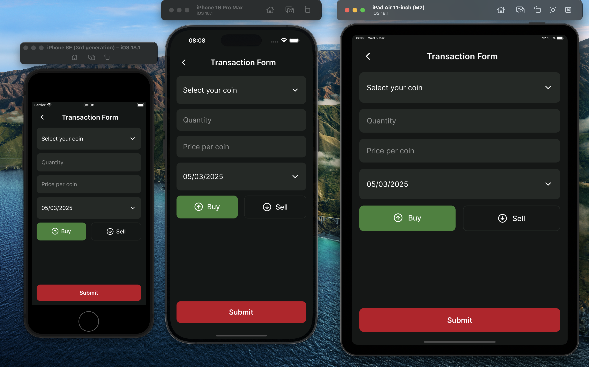

# Getting Started

Hey guys ! This project it is a small crypto portfolio made in a bare **React Native v0.76.7**.

## ⭐ Features
- ✅ **Portfolio Overview Screen**
   - Display a distribution overview of the portfolio by cryptocurrency
   - List of Coins:** Below the overview, display a list of cryptocurrencies currently held in the portfolio.
- ✅ **Coin Purchases Screen**
   - Display all transactions
   - Each transaction entry should detail the date, type (buy/sell), quantity, and price per coin at the time of the transaction.
- ✅ **Add Transaction Screen**
   - Provide a form for entering new transaction details for a selected cryptocurrency, specifying the transaction type (buy/sell), quantity, and price per coin.
   - Implement input validation to prevent erroneous data entry.
- ✅ **Performance and Persistence of Transactions**
   - Be aware of possible performance issues, since you are dealing with historic data that tends to increase with time.
   - You can use the JSON included in our slack channel
- ✅ **Pre-fixed List of Cryptocurrencies**
   - Incorporate a pre-defined list of popular cryptocurrencies for users to choose from when adding or editing transactions, simplifying the app's scope by not requiring live data.
- ✅ **Portfolio Value Over Time Chart (Optional)**
- ✅ **Edit Transaction Feature (Optional)**

### 💯 Extra features
- ✅ **Delete Transaction Feature**
- ✅ **Splash Screen, App Icon and Fonts**
- ✅ **Responsiveness**
- ✅ **Transaction Date Picker**
- ✅ **Toasts to give the user feedback**

# 🛠️ Technologies & Tools

##  State Management
Why I decided to go with [Realm DB](https://www.mongodb.com/docs/atlas/device-sdks/sdk/react-native/) to persist and show data to user.
- Realm DB its fast and has a low latency;
- With [@realm/react](https://www.npmjs.com/package/@realm/react) the interface its simplex and easy to use;
- We use the reference from the database itself, this helps to [save memory and increase speed](https://www.mongodb.com/docs/realm-sdks/java/10.0.1/io/realm/RealmResults.html)
- Realm only "uses" what needs to be used;
- There is a good company behind Realm, MongoDB, and since you guys used Mongo in your tech stack its awesome;

Other good option it is [WatermelonDB](https://github.com/Nozbe/WatermelonDB)

## Styling
I was [using react-native-unistyles v2](https://v2.unistyl.es/start/introduction/) in some personal projects, and I really like the concept of styling like a normal Stylesheet and using the c++ as the "core". I used in this project the [react-native-unistyles v3](https://www.unistyl.es) that is still in **BETA**. The others factors that I chose to use it was to show Felipe this awesome library and because I also would like to test it to see the power of V3 and the usage of breakpoints. ~~This guy is crazy to use a beta on a test project 🤣~~

## Charts
I like to use [React Native Directory](https://reactnative.directory) to find some libraries. I was looking to the charts options and the [react-native-gifted-charts](https://github.com/Abhinandan-Kushwaha/react-native-gifted-charts) appears to be a good choice. Since the popular library (react-native-chart-kit) it is not being updated for 3 years. the gifted-charts already supports the new archicture and its being actively maintaned.

I also like to search to see if I did a good choice 😅, I found a cool library that uses Skia graphics render behind:
- [Victory Native](https://commerce.nearform.com/open-source/victory-native/docs) uses react-native-skia graphics render combined with react-native-gesture-handler and react-native-reanimated. 

## Forms
I used [react-hook-form](https://react-hook-form.com) combined with [zod validator](https://zod.dev) to deal with the transaction form to create a better user experience with less code.

### Select
I like to use [react-native-bottom-sheet](https://gorhom.dev/react-native-bottom-sheet/) to create selectors on mobile in a customized way.

### Date Picker
I used the [react-native-date-picker](https://github.com/henninghall/react-native-date-picker) to provide a platform experience while selecting the date.

# 🚀 Run Project
>**Note**: Make sure you have completed the [React Native - Environment Setup](https://reactnative.dev/docs/environment-setup) instructions till "Creating a new application" step, before proceeding.
## Step 1: Start the Metro Server

First, you will need to start **Metro**, the JavaScript _bundler_ that ships _with_ React Native.

To start Metro, run the following command from the _root_ of your React Native project:

```bash
npm start
```

## Step 2: Start your Application

Let Metro Bundler run in its _own_ terminal. Open a _new_ terminal from the _root_ of your React Native project. Run the following command to start your _Android_ or _iOS_ app:

### For Android

```bash
npm run android
```

### For iOS

```bash
npm run ios
```

If everything is set up _correctly_, you should see your new app running in your _Android Emulator_ or _iOS Simulator_ shortly provided you have set up your emulator/simulator correctly.

This is one way to run your app — you can also run it directly from within Android Studio and Xcode respectively.

# ⚙️ Troubleshooting

Since I decided to go with react-native-unistyles v3 that is in beta we can have some issues in **Android** to build. It seems more related to the android studio not handling well the cache. The issue its: 
- Android Builds :react-native-unistyles:buildCMakeDebug[arm64-v8a]
- [Issue 568](https://github.com/jpudysz/react-native-unistyles/issues/568)
- [Issue 587](https://github.com/jpudysz/react-native-unistyles/issues/587)

Basically to fix you need to reinstall the react-native-unistyles deps and rebuild the project.

```shell
npm uninstall react-native-unistyles react-native-nitro-modules react-native-edge-to-edge 

npm install react-native-unistyles react-native-nitro-modules react-native-edge-to-edge 

cd android
./gradlew clean

npm run android
```

If you still run with problems do not hesitate to contact me.

# 🎨 UI/UX
I tried to follow the **Nilsen Heuristic** to a good user experience. I wil list some actions I add to follow these standards:
1. **Visibility of System Status:** I added a toast feedback when the user create/update/delete the transaction to know the action was done with success
2. **Match between system and the real world:** The app does not use difficult words specific to crypto world.
3. **User Control and Freedom:** I added a delete option to transaction in case he adds a wrong transaction.
4. **Consistency and standards:** I created a ListItem to follow the same design in the app and have utils functions to format numbers.
5. **Error Prevention:** I give the user a pop-up before deleting the transaction to not delete by accident.
6. **Flexibility and Efficiency of Use:** The user can quickly add transactions from the same coin if they start on the Coin Page.
7. **Aesthetic and minimalist design:** The app only show relevant information to the user.
8. **Help users recognize, diagnose and recover from errors:** In the form screen the user can has validations that clears after the input blur or the coin is selected.
9. **Help and Documentation:** At the beginning without transactions the user has some instruction on how to make the app starts to work properly.

I used the breakpoints from react-native-unistyles to achieve the responsiveness, I get the iOS common devices width and used as a parameter to build the breakpoints.

## 🎥 Videos

## 📷 Images





#  What's next?

I hope hearing back from you guys! 

Made with ❤️ by Lucas Dantas 👋🏽